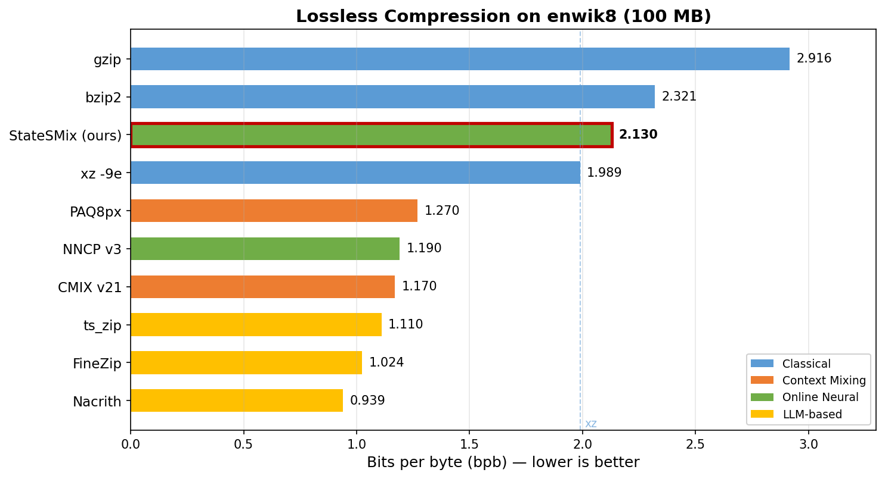

# StateSMix

**Online Lossless Compression via Mamba State Space Models and Sparse N-gram Context Mixing**

[](https://arxiv.org/abs/2605.02904)

📄 **Paper**: [StateSMix: Online Lossless Compression via Mamba State Space Models and Sparse N-gram Context Mixing](https://arxiv.org/abs/2605.02904) (arXiv:2605.02904, submitted 5 Apr 2026) by [Roberto Tacconelli](https://arxiv.org/search/cs?searchtype=author&query=Tacconelli,+R).

StateSMix is a fully self-contained lossless compressor combining an online-trained Mamba SSM with sparse n-gram logit biasing (bigram through 32-gram) and arithmetic coding. No pre-trained weights, no GPU, and no external dependencies are required.

## Results on enwik8

| File | StateSMix | xz -9e | Delta |
|------|-----------|--------|-------|
| 1 MB | 265,370 B (2.123 bpb) | 2.326 bpb | **-8.7%** |
| 3 MB | 805,926 B (2.149 bpb) | 2.271 bpb | **-5.4%** |
| 10 MB | 2,702,498 B (2.162 bpb) | 2.177 bpb | **-0.7%** |
| 100 MB | 26,622,640 B (2.130 bpb) | 1.992 bpb | +6.9% |

StateSMix beats xz on all file sizes up to 10 MB.

### Compression Landscape (enwik8 100 MB)



| System | Type | Params | bpb | GPU | Self-contained |
|--------|------|--------|-----|-----|----------------|
| gzip | LZ77+Huffman | --- | 2.916 | No | Yes |
| bzip2 | BWT+Huffman | --- | 2.321 | No | Yes |
| xz -9e | LZMA2 | --- | 1.989 | No | Yes |
| PAQ8px | Context mixing | --- | ~1.27 | No | Yes |
| CMIX v21 | LSTM+mixing | ~50M | ~1.17 | Optional | Yes |
| NNCP v3 | Transformer-XL | online | ~1.19 | Optional | Yes |
| ts_zip | RWKV-169M | 169M | ~1.11 | Optional | No |
| FineZip | LLaMA-3-8B | 8B | 1.024 | Yes | No |
| Nacrith | SmolLM2+mixing | 135M | 0.939 | Optional | No |
| **StateSMix (ours)** | **Mamba SSM** | **online** | **2.130** | **No** | **Yes** |

StateSMix is the only online neural compressor that requires no GPU and no pre-trained weights, while beating xz on files up to 10 MB.

## Ablation Study (enwik8 3 MB)

| Variant | Bytes | bpb | vs Full |
|---------|-------|-----|---------|
| Count only (frequency prior) | 1,571,738 | 4.191 | +95.0% |
| N-gram + count (no SSM) | 1,319,045 | 3.517 | +63.6% |
| SSM + count (no n-grams) | 840,095 | 2.240 | +4.2% |
| **Full (SSM + all n-grams)** | **805,926** | **2.149** | **---** |
| xz -9e | 851,572 | 2.271 | +5.7% |

**Key findings:**

- **SSM is the core engine**: The SSM alone achieves a **46.6% reduction** over the count-only baseline and already beats xz by 1.3% without any n-gram component.
- **N-grams alone are weak**: Without the SSM, n-gram tables achieve only 16.1% reduction over count-only — far behind xz. The n-gram logit bias requires a good base distribution to be effective.
- **N-grams complement the SSM**: On top of the SSM, n-grams provide an additional **4.1% reduction** (840 KB to 806 KB), pushing the full system 5.4% below xz on 3 MB.
- **Long-range context matters**: The 16-gram and 32-gram tables capture repeated multi-token patterns (article templates, citations) that the 8-gram model cannot reach, contributing ~2-3 KB additional savings on 3 MB and ~89 KB on 100 MB.

## Building

```bash
make
```

Requires GCC with AVX2/FMA support. OpenMP is used for parallel training.

## Usage

```bash
# Compress
./ssm_best_version2 c input_file output_file.ssm

# Decompress
./ssm_best_version2 d output_file.ssm recovered_file

# Verify (compress + decompress + compare)
./ssm_best_version2 v input_file
```

## Architecture

- **SSM**: Mamba-style (DM=32, DS=16, DI=64, NL=2), ~120K parameters, trained online with Adam
- **N-gram tables**: Bigram through 32-gram with softmax-invariant sparse logit bias
- **Arithmetic coding**: 32-bit range coder, AC_SCALE=2^16
- **Tokenization**: GPT-NeoX BPE (49,152 types) with compact vocabulary remapping
- **Speed**: ~2,000 tok/s on 4 cores (~700 KB/s), ~4.2 hours for enwik8 100 MB
- **Memory**: ~6 GB RAM (dominated by 9 n-gram hash tables, 16M slots each)

See `architecture.txt` for detailed documentation and `ssm_compress_paper.tex` for the research paper.

## Requirements

- GCC with `-mavx2 -mfma` support
- ~6 GB RAM for 100 MB input files
- Tokenizer binary in `tokenizer/tokenizer.bin`

## License

Apache License 2.0. See [LICENSE](LICENSE).

## Citation

```bibtex
@article{tacconelli2026statemix,
  title={StateSMix: Online Lossless Compression via Mamba State Space Models and Sparse N-gram Context Mixing},
  author={Tacconelli, Roberto},
  journal={arXiv preprint arXiv:2605.02904},
  year={2026},
  url={https://arxiv.org/abs/2605.02904}
}
```

## Author

Roberto Tacconelli (tacconelli.rob@gmail.com)
